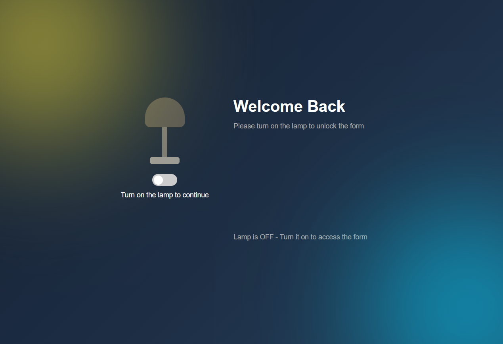
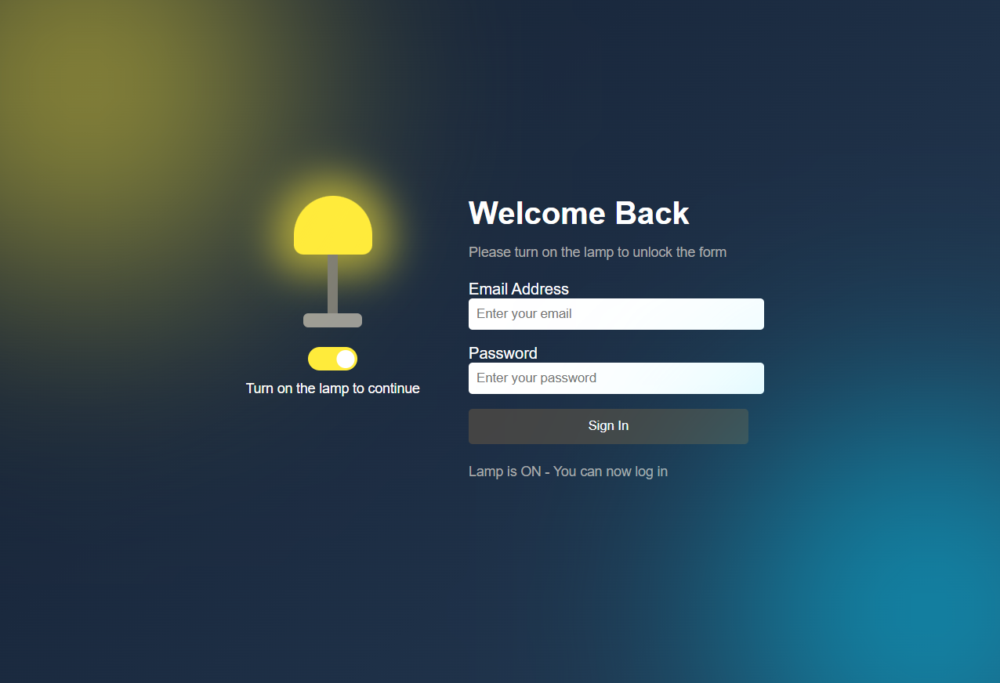

# Lamp Login Interface 🌟

A **creative login interface** that uses an **interactive lamp metaphor** to unlock the form.  
The lamp acts as a **toggle switch**: when turned **ON**, the login form becomes accessible.

### Lamp Login Demo

**Step 1 – Lamp OFF**


**Step 2 – Lamp ON**


 *(Add animated screenshot here)*

---

## ✨ Features
- **Interactive Lamp Switch**: Toggle lamp ON to reveal login form
- **Modern UI Design**: Gradient backgrounds, glowing effects, smooth transitions  
- **Secure Login Form**: Email/password fields with validation structure
- **Dynamic Messaging**: 
  - Lamp OFF: *"Turn on the lamp to continue"*
  - Lamp ON: *"You can now log in"*

---

## 🛠 Tech Stack
Frontend:

── HTML5 - Semantic structure
── CSS3 - Gradients, animations, glow effects
── Vanilla JavaScript - Toggle logic & form control


---

## 🚀 Quick Start

### Live Demo
[](https://nsovokmushwana.github.io/lamp/)

### Local Setup
```bash
# 1. Clone repo
git clone https://github.com/nsovokmushwana/lamp.git
cd lamp

# 2. Open index.html
# Double-click index.html or use Live Server extension
```

**No server required** - Pure frontend!
